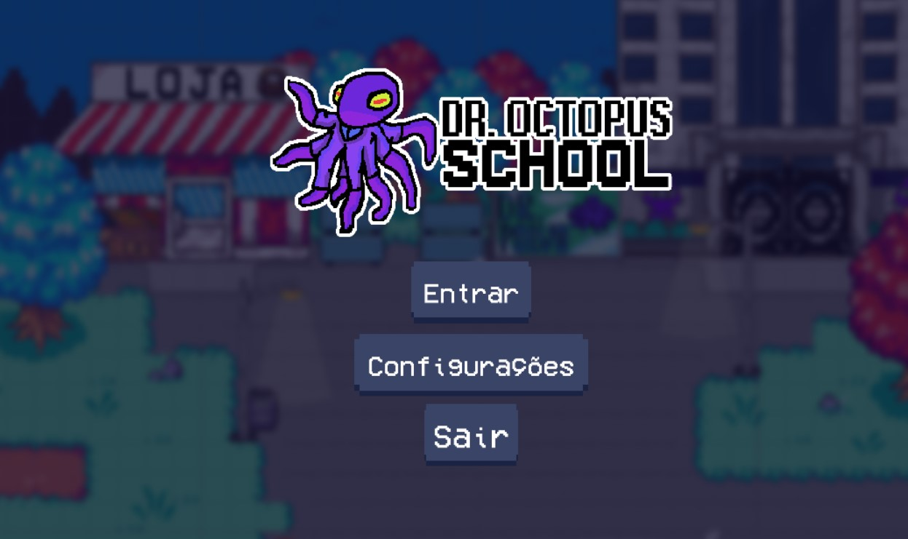
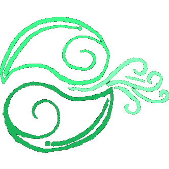

<h1> Dr. Octopus School 🐙</h1>
<p align="center">
  <br>
</p>

A game designed for students and teachers who are interesteds in a faster way to communicate between each other. <br>
This school game and all his components made were our Final Paper project, focused to make students life easier. <br><br>

<h2> 🟩 About our project 🟩 </h2>
The idea of the game was created by PlopesK, followed by all members aprovance. <br>
It would be a project focused on manking a game integrated with a school system. <br><br>
With the idea stabilized, we only had to decide were to produce it. We were between Unity and Godot to initiate, choosing to utile Unity in the end, since it has more support to do researches. <br>
All game elements were heavely inspired by a browser game called "Club Penguin", with sadly isn't acessible by the public anymore, since it was closed...<br><br>

 ```diff
  # 🐧Press F to pay respects...
 ```
<br>
Our first problem was to "How to create an online game?", we already knew how to create and manipulate databases, but this was a totally new experience. <br>
With a lot of researches, Mr.Guisamuel finded the Photon system, with is a multiplayer engine free to use, and then decided to use it. <br><br>

After that, our team was divided focusing to create a fully online game within less than an year! Setting differents functions to each member!<br><br>

<h2> 🟢 Game Mechanics 🟢 </h2>
The game contain a lot of mechanics, such as customization, many minigames, the hability to talk in a chat or via letters, being able to acess your grades and even comunicate with the school!<br>
And even better! It works wich full access to online elements, such as seeing other players on the map and their messages!<br><br>
Since the idea was to only being able to enter using an created account, the system would only allow the school to create their students accounts (making a safier and easier to moderate system).<br><br>

<h2> 🟪 Conclusion 🟪 </h2>
Gladly, the public loved our project :) <br>
Plus, we had a lot of fun working on it!<br><br>

And even better, we learned a lot! Both about how to work alongside team members and about organizating ourselves inside projects!<br>
<s>Alongside some programming lessons</s>

<h3>Take a look at our website here: <a href="https://github.com/GGGCD-TCC/anemo-system-website"> Anemo System Website </a></h3>
<a href="https://gggcd-tcc.github.io/anemo-system-website/">
 
</a>
